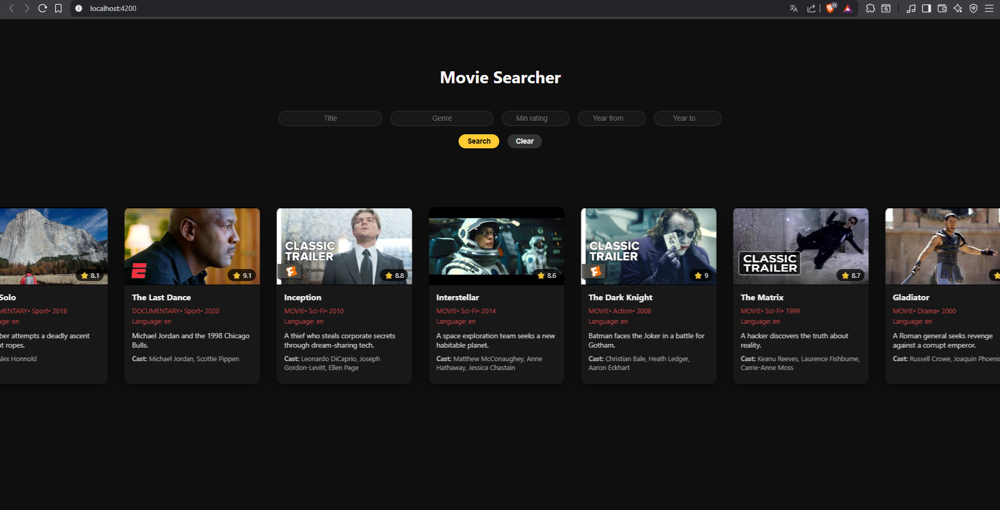
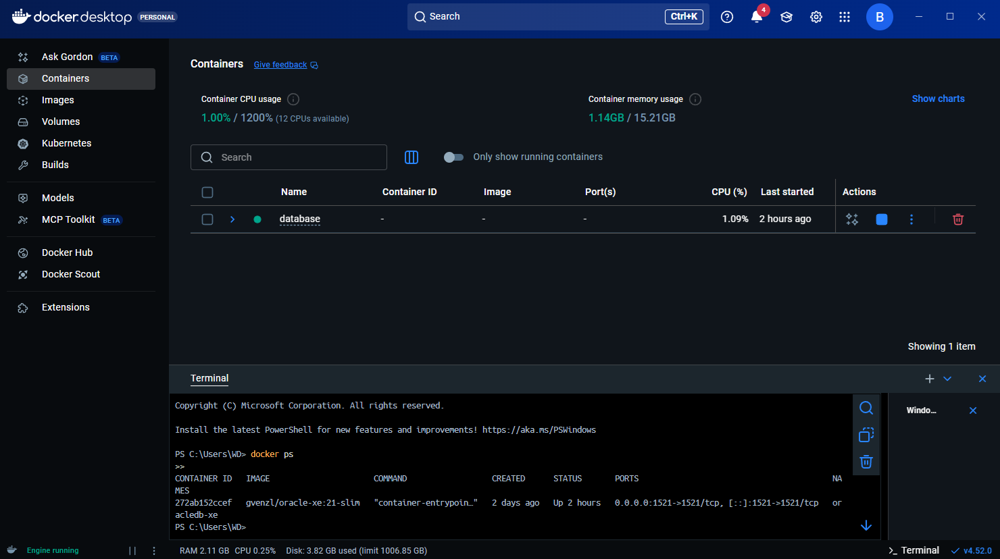
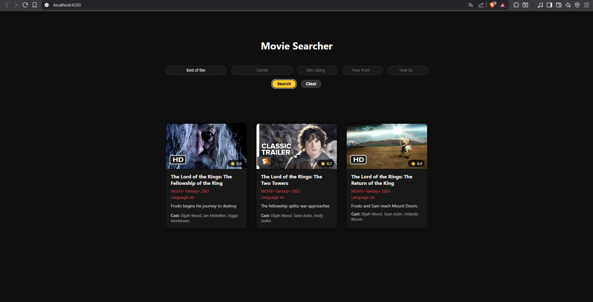
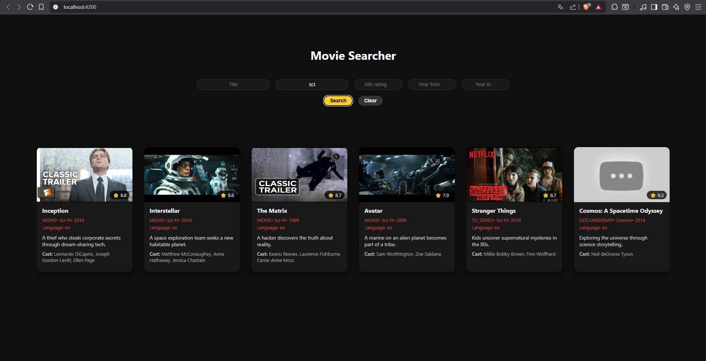

# Movie Searcher - 🎬

This project is a modern, responsive movie browsing interface built with **Angular 21**, **Spring Boot** backend, and an **Oracle Database running inside Docker**.  
It features real-time filtering, animated previews, and a clean minimalist UI inspired by popular streaming platforms.

To run this project: **docker compose up --build** ------ http://localhost:4200/

### The database is running inside a docker.

## Hover Animation (Interactive Movie Cards)

Each movie is displayed as an animated card that reacts to user interaction:

- Smooth **hover lift effect**
- Deepened shadow for emphasis
- Instant, responsive animation
- Gives the UI a premium, polished feeling

## Infinite Marquee Scrolling Row

The homepage contains a dynamic **horizontal marquee** that continuously scrolls movie cards:

- Cards smoothly move from right → left
- Animation **pauses on hover**
- Automatic duplication of items for a seamless infinite loop
- If the result list is short, the marquee automatically disables itself

## Trailer Preview Modal (YouTube Autoplay)

Clicking on any movie card opens a centered **1280×720 trailer preview window**:

- Supports any YouTube URL
- Automatically converted into an embeddable autoplay video
- Modal backdrop for cinematic feeling
- Closes with outside click or “X” button

## Advanced Search & Filtering

The application includes a filtering toolbar:

- Filter by **title**
- Filter by **genre**
- Filter by **minimum IMDb rating**
- Filter by **year range (from → to)**
- "Clear" button resets all filters
- Filters dynamically update movie results
- Marquee scrolling automatically adapts to the number of results

